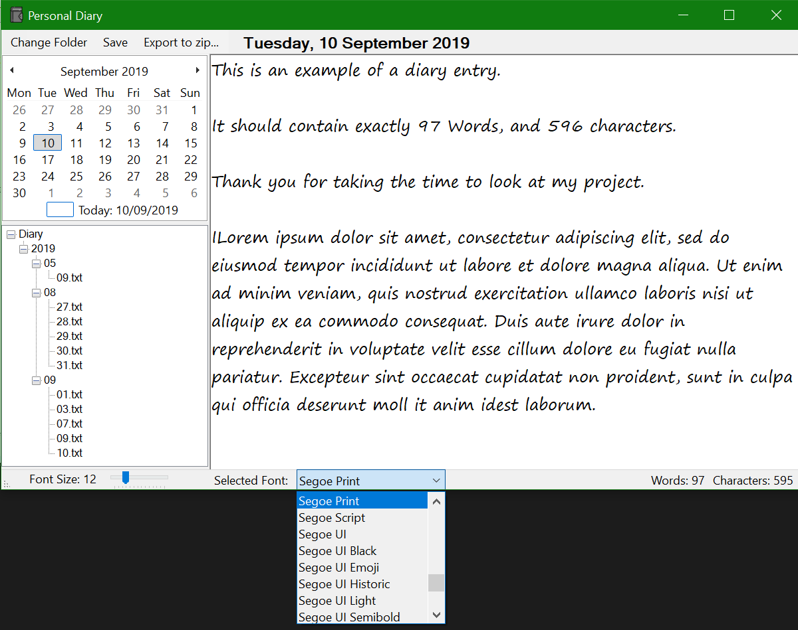

#  A Possible Diary Application for Windows (so far)
This is just an experiment to see if I can create an application that functions as a Diary. It is by no means fully featured.
Created in VB.Net. Requires .Net Framework 4.0 or above

## Usage
When the application starts up, you must select the root folder of your diary. Once selected, you will now be able to add entries by selecting a date on the calendar. This will create a simple .txt file organised in a RootFolder\\Year\\Month\\Day.txt hierarchy that can be seen in the TreeView box. You can also take these files anywhere else as they are plain text.

## Features
* Can choose where to save your diary to
* Simple interface, can select date and file is made automatically
* Portable (just run)
* Tiny, less than 400kb
* Works on Linux under Wine (Tested Wine 4.0 + Mono)

## Planned Features
* Export to .zip file
* Encription (hopefully)

## Changelog
* Root of Diary selection saved for next open
* Added word and character count
* Removed buttons and made a menustrip
* Added automatic save when changing the date in either calendar or tree view
* Entry automatically expands on window size change
* Added Icon (modified https://www.pngrepo.com/svg/286823/diary [CC Licence])

## Screenshot

